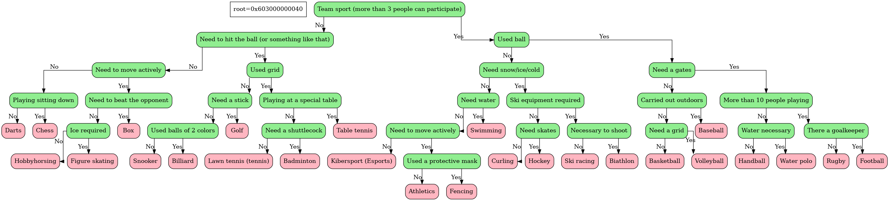
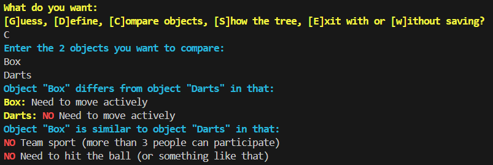

# **Akinator**


<div style="margin-left: 190px;">

**Akinator** - is a unique game in which you can guess an object, and a special algorithm will try to guess your object (of course, if it is known to Akinator). It is also possible to define objects and compare them with each other.

At the moment, a database is being used with various sports, ranging from well-known football and hockey, and ending with...🤭

</div>


## Installation and compilation
To run the program on your computer, download the repository and run the Makefile
1. Cloning a repository
```bash
https://github.com/Yan103/Akinator.git
```
2. Compilation of source files
```bash
make
```
3. Start
```bash
make run
```
4. Optional: remove files (deleting object and executable files)
```bash
make clean
```
5. Optional: remove dump files (deleting .png and .html files)
```bash
make clear_dump
```
For a more detailed study of the principle of operation of the program, you can also read the *documentation* that is available in.

## Principles of work
The algorithm uses a binary tree data structure. Depending on the answer to the corresponding question (yes or no), the Akinator goes down the tree and eventually offers the user its answer.

If the user has guessed another word, the Akinator can add a new word to its database. At the end, you will need to use a end with save.



It is also possible to show the user the entire database in the form of a binary tree, define an object or compare 2 elements (find their similarities and differences)



## Contact information
If you are interested in this project or have any questions/suggestions about the project, you can contact the author:

**Mail**: fazleev.yans@phystech.edu

**Telegram**: @yan_ya_n3


